# OpenPLC-LD-Core-Concepts
After looking for information on how to structure programs I ran across this site: https://www.contactandcoil.com/patterns-of-ladder-logic-programming/.
These projects are just implementing the patterns here for reference to be used in other projects. I might add to this as I come up with more along the way.

## Patterns/Concepts

### Sealed In Coil
The sealed in coil is used to have a one time set value. When the PLC is turned off the value is then reset. 

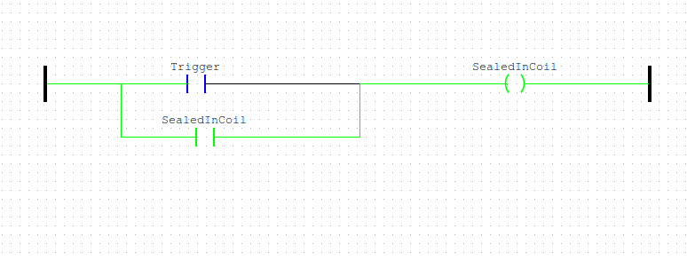

### Memory Coil
Similar to the Sealed in coil this is used to save a state. Unlike the sealed in coil this has a break condition. his is commonly used for fault sensors. When a fault triggering condition is meant the fault state is saved and needs to be reset. This also means if it is reset without the condition being removed it will just go right back to the fault state.

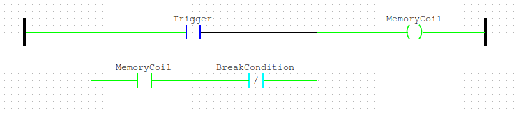

### Start/Stop
Very Similar to the memory coil. Main difference is in what dominates the state. In the memory coil if both trigger and reset are active the trigger wins the state. This is important for things like fault sensors. The latch is the opposite. Here the Reset is dominate. This is useful for start/stop functions. In a situation for example where the start button is stuck you still want your stop button to stop the process. 

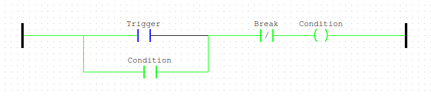

### Latch
Uses different blocks but same idea as start and stop. Main difference is where start and stop is meant to reset on power down, latch is meant to hold that state memory. 

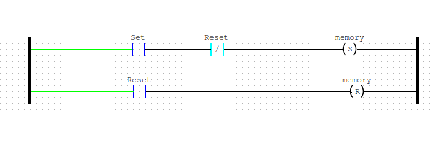
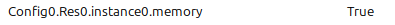

### Flashers
The flashers pattern is a way to flash a coil on/off. You can control the period of time for the on and the off state. There are multiple ways of doing this. I prefer the TON TOFF method. This is also a good candidate for a Function Block since you may have multiple things that need to flash.

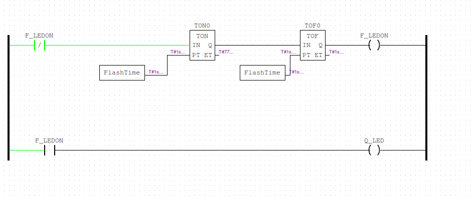

### Input Map
The input map is used to map physical I/O to internal values. This is useful for cases where you have multiple instances of a single I/O. If the I/O location ever changes you don't need to hunt down and update every instance of it. Just the mapping. This pattern can be slightly adjusted to include outputs. 

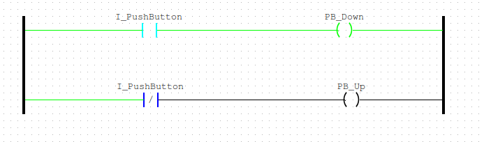

### Step
This is a pattern for sequences. When there is a start condition proceed with step 1 and on a step 1 end condition move to step 2 ect.

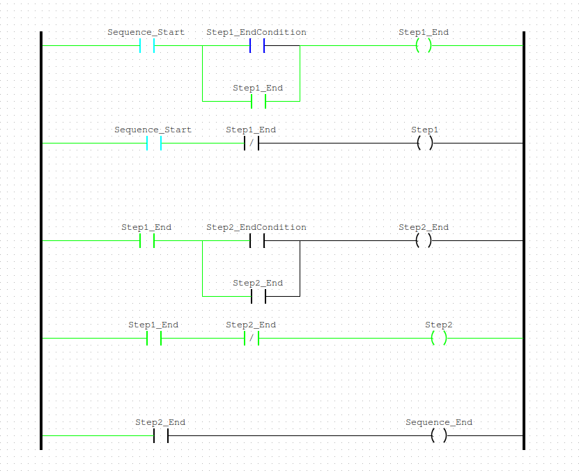

### Mission
I hesitated to add this because of how similar it is to Step but the differences are important enough to show. Where as step runs you through a specific order, mission just makes sure options are only being run when allowed. If you have various tasks that can't run while the other is running the mission pattern keeps them separate. This can be the parent that triggers the step pattern for each mission. 

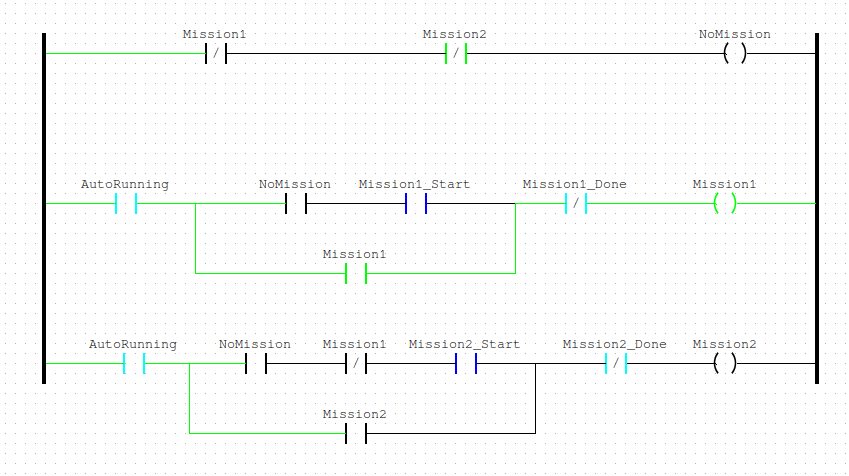

### 5 Rung
This pattern is focused on a machine "motion" or focus. If you are at a bottle filling station this pattern controls the trigger for filling, the conditions that it is safe to run(will auto cut off when that condition fails), triggering the run command(Can make into a new program or maybe FB depending on needs), an end condition, and fault logic. 

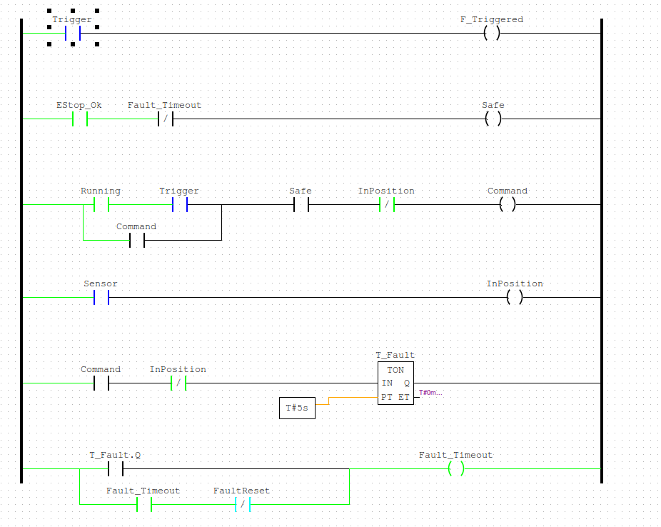

### Mode
Some systems have different modes. Think Manual v Auto. This pattern concerns managing those modes. 

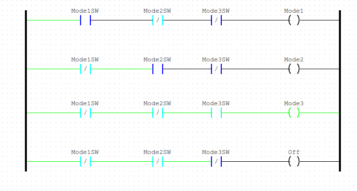

## Summary
Because of the simplicity of yes/no logic, a lot of these patterns are very similar and are very flexible. Mode is a great example of this. Nothing behind the pattern itself says this is THE way of handling modes nor is it especially unique from other patterns. The importance of these patterns is more about having ways of framing normal problems to solve and some easy reference ways to solve them. 